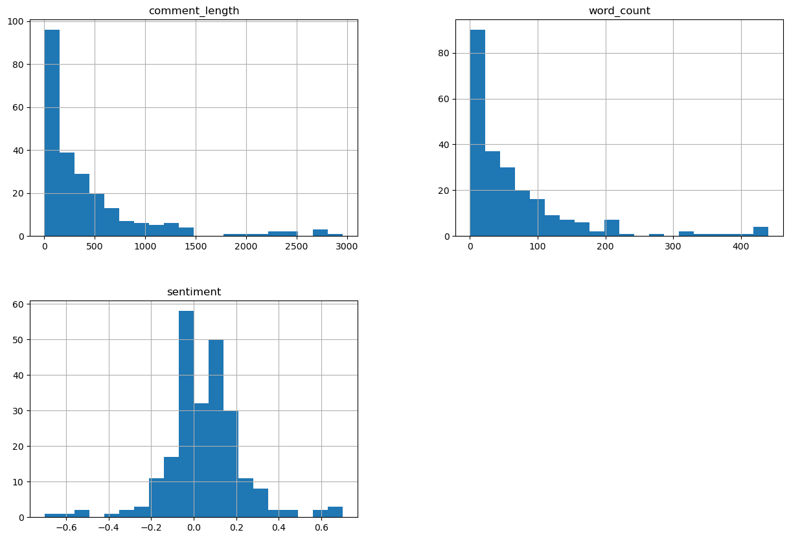
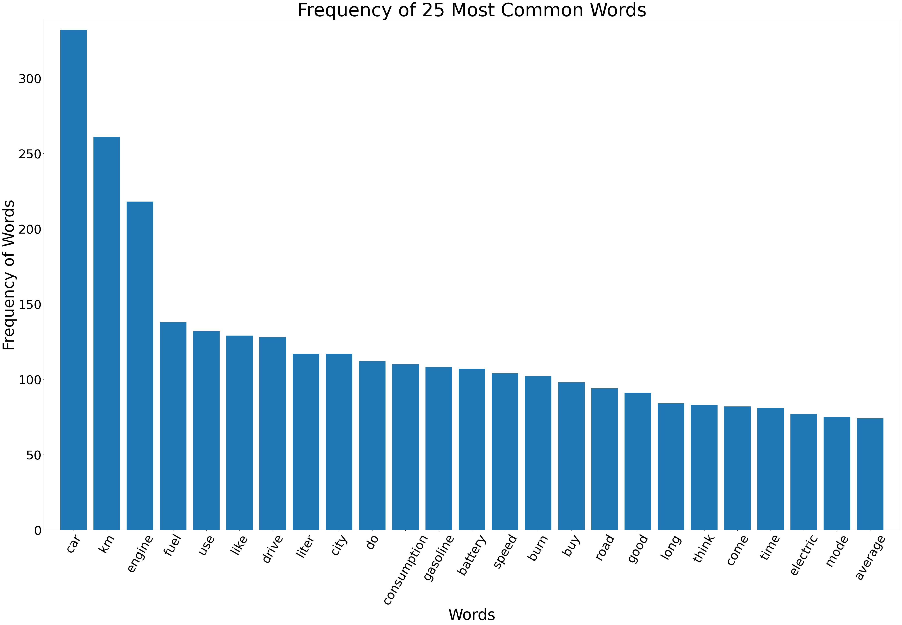
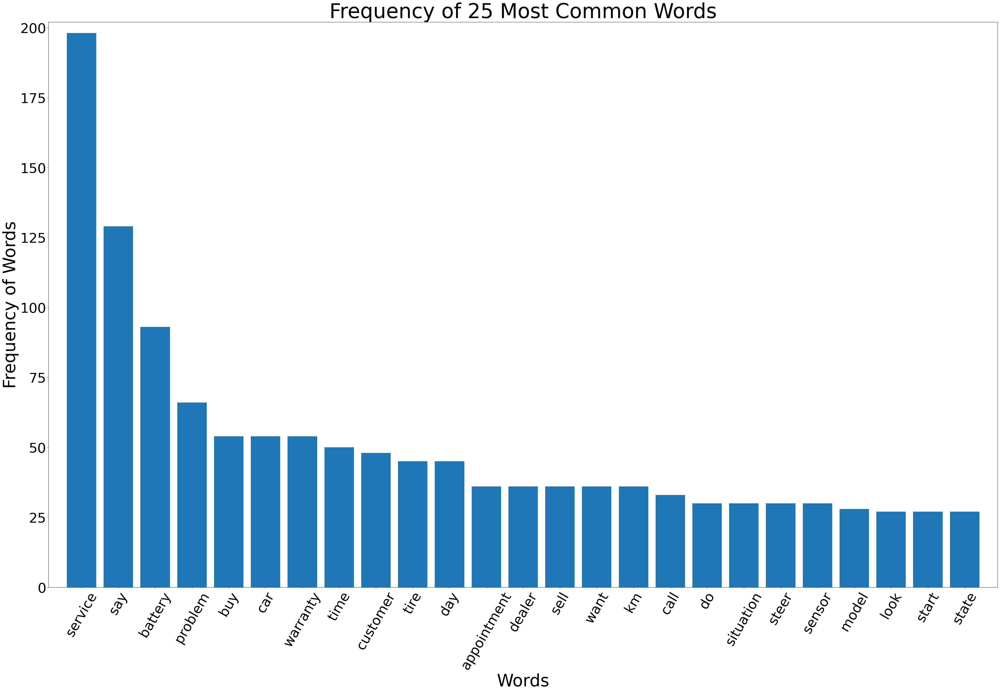
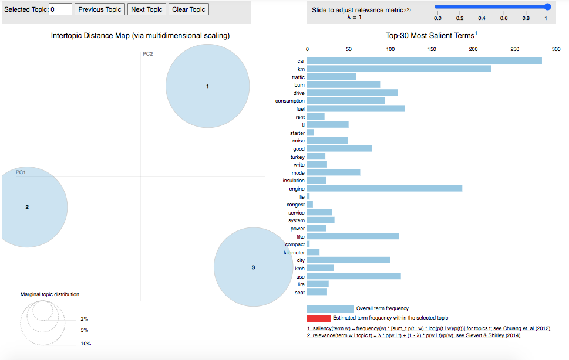
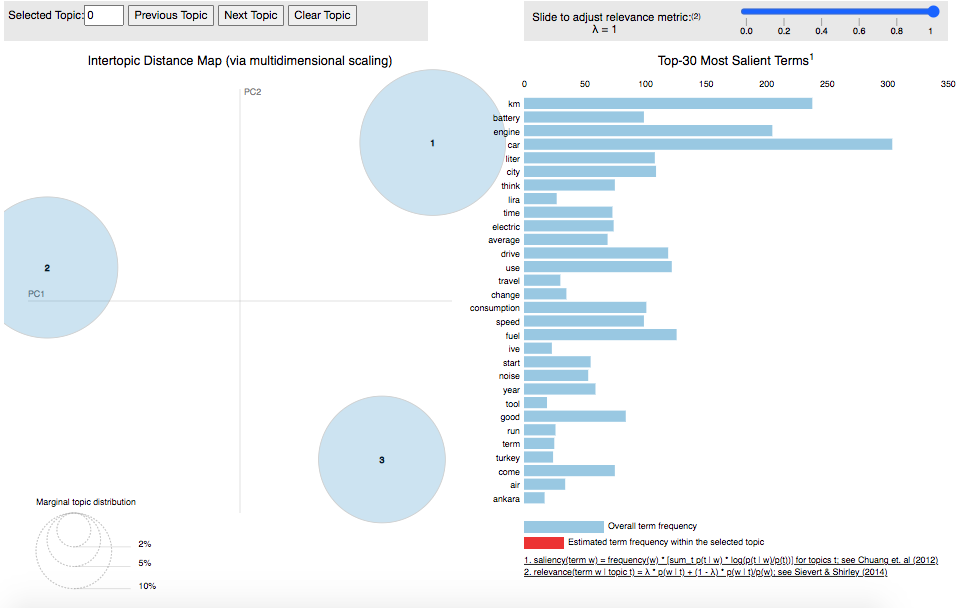
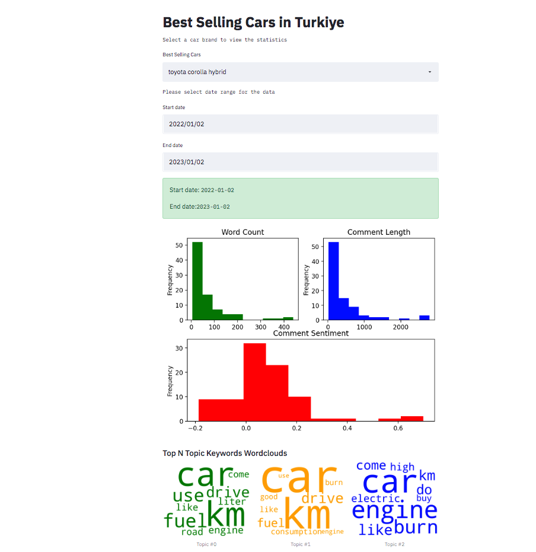

# Car Comment Analysis and Application

# 0. Business Understanding

Aim of this analysis to create a generic application using a machine learning algorithm to provide information to potential car buyers from public data.
You can find the blog post about this analysis on: 
https://istavrit.de/2022/12/31/You-should-check-it-before-buying-a-new-Toyota-Corolla-Hybrid.html

# 1. Data Understanding

The aim of this analysis is to build a topic model about "toyota corolla hybrid" car reviews and complaints. In order to collect the data, crawled eksisozluk.com and sikayetvar.com about the keyword.
There are 236 comments on eksisozluk and 60 complaints on sikayetvar.com.

### Eksisozluk Comments

### Sikayetvar Complaints

# 2. Data Preparation

* Cleaned special characters, removed redundant words like "toyota","corolla", "vehicle". 
* Translated comments and complaints from Turkish to English.
* Created comment_length, word_count and sentiment features.
* Binned comment_length feature.
* Lemmatized comments.

1. Crawled keyword "toyota corolla hybrid" from
* eksisozluk.com
* sikayetvar.com

2. Analyzed data.
3. Created 3 main topics from comments and complaints using LDA.

# 3. Modeling

Used LDA to find three topics from the comments and complaints.

# 4. Evaluation

### Ekisozluk comments

1. Topic_0: 0.023*"km" + 0.019*"car" + 0.013*"engine" + 0.009*"liter" + 0.009*"fuel" + 0.009*"speed" + 0.008*"use" + 0.007*"drive" + 0.007*"consumption" + 0.007*"do"

2. Topic_1: 0.016*"car" + 0.011*"engine" + 0.010*"km" + 0.009*"like" + 0.007*"drive" + 0.007*"electric" + 0.007*"use" + 0.006*"road" + 0.006*"gasoline" + '0.006*"fuel"

3. Topic_2: 0.023*"car" + 0.013*"engine" + 0.009*"km" + 0.009*"city" + 0.009*"fuel" + 0.008*"use" + 0.008*"battery" + 0.008*"drive" + 0.008*"like" + 0.007*"consumption"

### Perplexity and Coherence Score

Perplexity:  -7.215
Coherence Score:  0.286

Lower the perplexity better the model
Higher the topic coherence, the topic is more interpretable

1. Cars consumption efficienty  
2. Cars speed
3. More or less similar as 1.

### Sikayetvar complaints

1. Topic 0: 0.044*"car" + 0.033*"km" + 0.024*"engine" + 0.018*"fuel" + 0.017*"battery" + 0.015*"consumption" 0.014*"like" + 0.014*"think" + 0.014*"use" + 0.013*"gasoline"

2. Topic 1: 0.038*"km" + 0.037*"car" + 0.021*"drive" + 0.021*"city" + 0.020*"liter" + 0.020*"use" + 0.017*"fuel" + 0.016*"do" + 0.016*"engine" + 0.015*"burn"

3. Topic 2: 0.036*"engine" + 0.033*"car" + 0.019*"km" + 0.016*"speed" + 0.016*"like" + 0.016*"battery" + 0.015*"electric" + 0.013*"buy" + 0.013*"fuel" + 0.012*"drive"

### Perplexity and Coherence Score

Perplexity:  -6.282
Coherence Score:  0.254

Lower the perplexity better the model
Higher the topic coherence, the topic is more interpretable

1. First topic is generally about engine.
2. Second one is about consumption.
3. Third one is similar to second but also about battery.

# 5. Deployment

You can run the application on your local machine:
1. Install virtualenv `pip install virtualenv`, then create a virtualenv , finally activate it.
2. Install necessary packages `pip install -r requirements.txt`
3. Run  `streamlit run run.py`

## Car Comment Analyzer Web Application

Created a streamlit application that enables users to select a car brand, date range and shows topics and related keywords.

### Instructions

1. run `pip install requirements.txt` to install necessary packages.
2. run `streamlit run app.py` 
3. go to http://localhost:8501